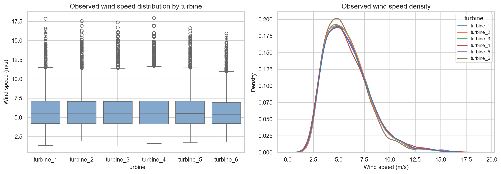
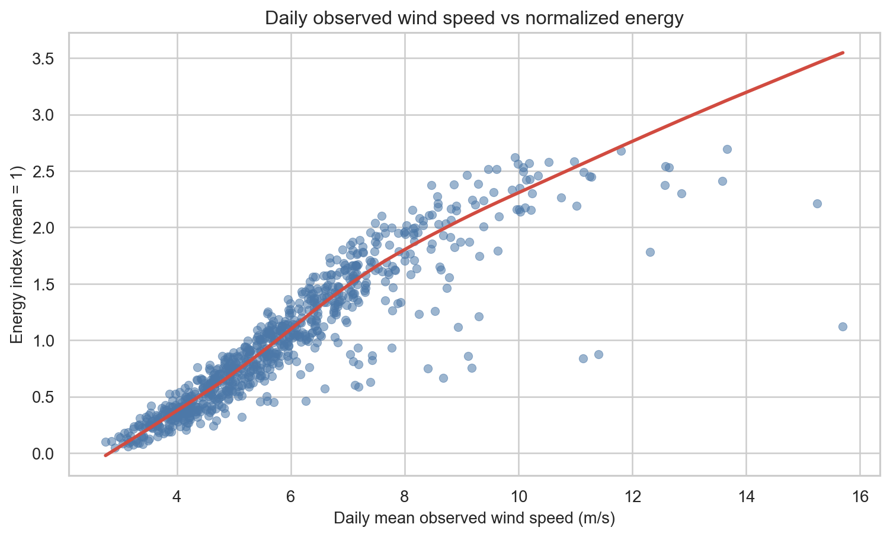
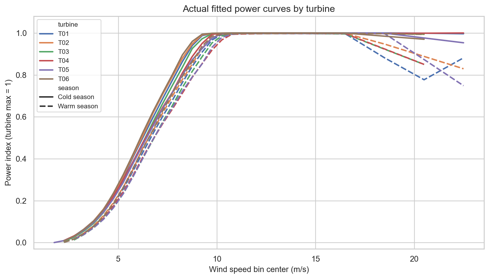
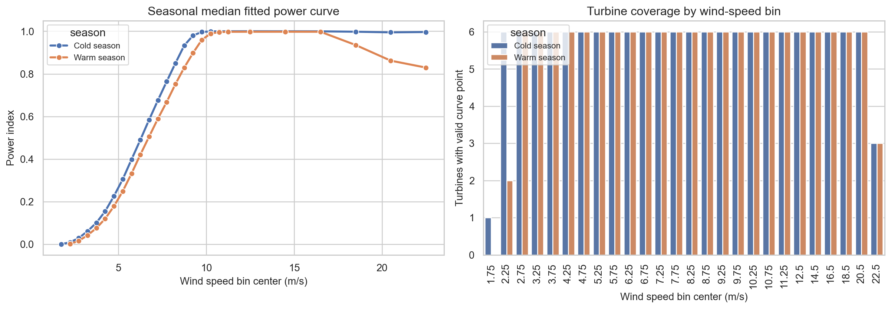
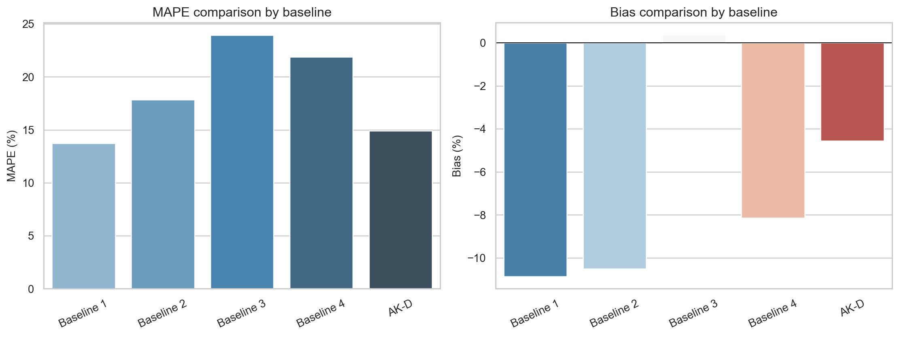
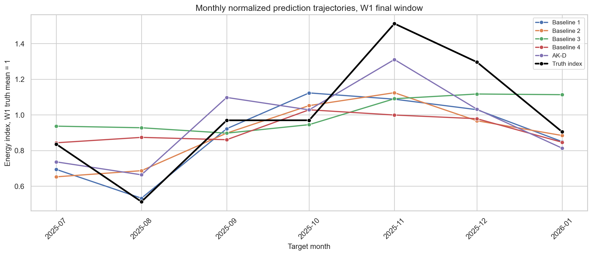
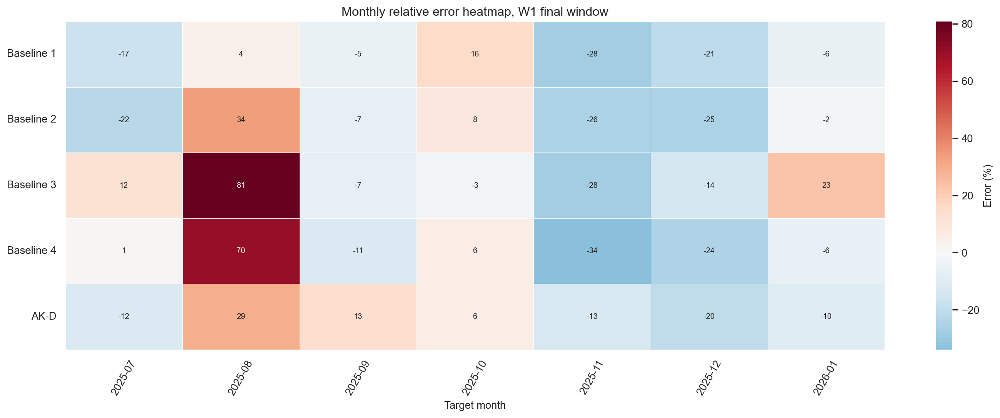
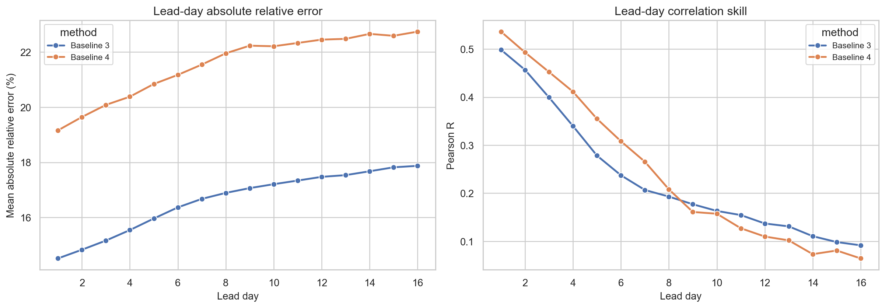

# Wind Power Baselines

This repository is a public, data-safe walkthrough of wind power monthly point forecasting baselines.

## What Is Included

- `notebooks/01_power_curve_fitting.ipynb`: SCADA-style sample data cleaning, preprocessing, empirical power curve fitting, and fitting diagnostics.
- `notebooks/02_point_forecast_baselines.ipynb`: final point forecasting baselines: Baseline 1, Baseline 2, Baseline 3, Baseline 4, and AK-D.
- `src/wind_power_baselines/`: small functional utilities for cleaning, preprocessing, power curve construction, baseline prediction, metrics, and plots.
- `data_sample/`: synthetic sample data only.
- `results_public/`: anonymized real evaluation results. Absolute energy values are not published.
- `figures/`: public-safe PNG figures rendered from sample data, anonymized real metrics, and local real intermediate outputs.

## Data Safety

The real project used private wind farm data, raw SCADA files, forecast files, and internal paths. Those files are intentionally excluded.

Public results use normalized indices and percentages:

- `energy_true_index`
- `energy_pred_index`
- `mape_percent`
- `bias_percent`
- `pearson_r`

No original kWh/GWh series, local drive paths, credentials, or raw station files are included.

Raw SCADA and raw mast/met-tower tables are not committed. Some figures are rendered from local real intermediate outputs and then published as PNG files so the notebooks can show realistic distributions, fitted curves, monthly errors, and lead-day behavior without exposing source tables.

## Figure Gallery

### Power Curve And Observed Wind









### Point Forecast Evaluation









## Notebook Reading Order

1. Open `notebooks/01_power_curve_fitting.ipynb` to understand how turbine-level data becomes empirical power curves.
2. Open `notebooks/02_point_forecast_baselines.ipynb` to see how those curves support monthly point forecasting baselines.

## Quick Start

```powershell
python -m pip install -e .
python -m unittest discover -s tests
jupyter notebook notebooks
```

## Final Baselines

| Method | Description |
| --- | --- |
| Baseline 1 | Historical same-month energy mean |
| Baseline 2 | ERA5/climatology idea + seasonal power curve + P50 |
| Baseline 3 | EC45 + LLS correction + power curve |
| Baseline 4 | EC45 + similar-day / coverage selection + power curve |
| AK-D | Monthly AK correction, keeping the AK route but fitting correction by month |

## Public Metrics Summary

| method     |   month_count |   mape_percent |   bias_percent |   pearson_r |
|:-----------|--------------:|---------------:|---------------:|------------:|
| Baseline 1 |             7 |        13.7335 |       -10.8713 |      0.8213 |
| Baseline 2 |             7 |        17.8611 |       -10.5125 |      0.8126 |
| Baseline 3 |             7 |        23.9285 |         0.382  |      0.637  |
| Baseline 4 |             7 |        21.8996 |        -8.1442 |      0.6357 |
| AK-D       |             7 |        14.9095 |        -4.5566 |      0.8837 |

## Repository Boundary

This repository documents the baseline construction and evaluation process. It does not publish private source data, internal file paths, or the full private reproduction archive.
